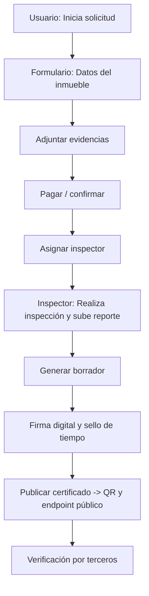
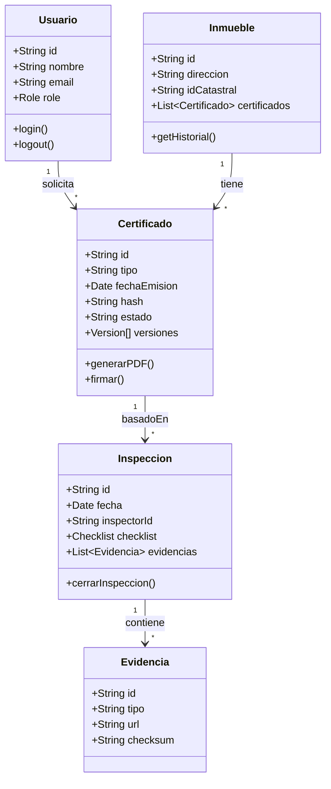
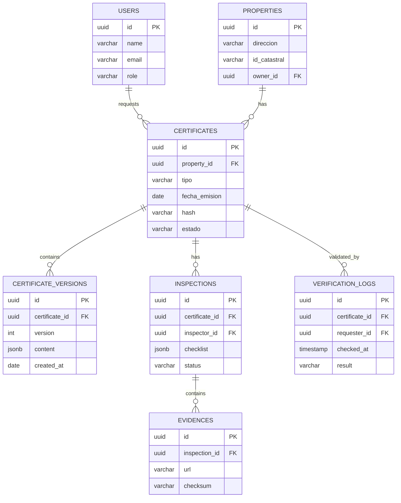

# Capítulo IV: Product Design

## 4.1. Style Guidelines

### 4.1.1. General Style Guidelines
**Producto:** CertiInmueble  
**Brand Promise:** Transparencia, confianza y trazabilidad en transacciones inmobiliarias mediante certificados digitales verificables.  
**Tono comunicacional:** Profesional, cercano, claro y técnico cuando aplica. Evitar jerga legal sin explicación.

**Valores visuales:**
- Confianza → colores sobrios y contrastes altos donde importe (estado legal/alertas).
- Legibilidad → tipografías sans-serif con buena legibilidad a pantalla y móvil.
- Jerarquía → uso consistente de tamaños de tipografía, cards y iconografía.
- Accesibilidad → contrast ratio ≥ 4.5:1 para texto normal; navegación por teclado y ARIA en componentes.

**Paleta sugerida (tokens):**
- Primary: `#0B4F6C` (azul profundo)
- Secondary: `#2E8B57` (verde moderado)
- Accent: `#F2A365` (naranja suave)
- Neutral 900: `#0F1724` (texto principal)
- Neutral 100: `#F7FAFC` (fondo claro)
- Danger: `#D9534F` (alertas legales / revocaciones)

**Tipografías:**
- Inter (primaria): para interfaces y títulos.
- Open Sans (secundaria): para cuerpo y documentos.
Tamaños base (desktop): H1 36px, H2 28px, H3 22px, Body 16px, Small 14px.

**Iconografía y fotografías:**
- Iconos lineales con peso medio.
- Fotografías: imágenes reales de inmuebles (alta resolución) y diagramas/tomas focalizadas (plano, fachada, grietas) con metadatos EXIF como evidencia.

**Botones y estados:**
- Primary CTA: fondo Primary + texto blanco.
- Secondary: borde Primary transparent background.
- Disabled: 30% opacity.
- Microcopy: usar verbos claros (“Verificar”, “Descargar certificado”, “Solicitar inscripción”).

---

### 4.1.2. Web Style Guidelines 
**Design tokens (ejemplos CSS variables):**
```css
:root {
  --color-primary: #0B4F6C;
  --color-secondary: #2E8B57;
  --color-accent: #F2A365;
  --color-neutral-900: #0F1724;
  --color-neutral-100: #F7FAFC;
  --radius-md: 8px;
  --shadow-sm: 0 1px 3px rgba(0,0,0,0.08);
  --font-sans: 'Inter', system-ui, -apple-system, 'Segoe UI', Roboto, 'Helvetica Neue', Arial;
}
```

**Componentes clave (atomic):**
- Header (logo + search de inmuebles por dirección/SUNARP + login).
- Hero card (buscar inmueble por ID catastral o dirección).
- Certificate card (miniatura del certificado con QR y estado).
- Evidence gallery (fotos, PDF, vídeo).
- Timeline/Historial (versiones del certificado).
- Modal de verificación (mostrar hash, firma, sello de tiempo).
- Panel administrativo (gestión de solicitudes, revisiones, revocaciones).

---

## 4.2. Information Architecture

### 4.2.1. Organization Systems
Estructura principal del sitio (top-level):
- Inicio
- Buscar inmueble
- Generar solicitud / Nuevo certificado
- Mis certificados (usuario)
- Verificar certificado (pública, por QR o hash)
- Integraciones / API (Documentación para integradores)
- Ayuda / FAQ / Soporte
- Panel institucional (notarías, bancos, municipalidades)
- Dashboard (para verificadores técnicos)

### 4.2.2. Labeling Systems
Nombres claros y consistentes:
- “Buscar por dirección / SUNARP / ID catastral”
- “Solicitud de certificación”
- “Historial de certificaciones”
- “Validar certificado (QR/Hash)”
- “Evidencias y fotografías”

La etiqueta de cada acción debe ser verbo + objeto: “Generar certificado”, “Ver historial”, “Descargar PDF”.

### 4.2.3. SEO Tags and Meta Tags
Ejemplos para páginas críticas:

**Inicio**
- Title: CertiInmueble — Certificados digitales verificables de inmuebles
- Meta description: Obtén certificados digitales verificables del estado legal, técnico y estructural de inmuebles. Firma electrónica y validación en línea.
- Keywords: certificado inmueble, verificación SUNARP, certificado técnico inmueble, firma electrónica

**Verificar certificado**
- Title: Verificar certificado — CertiInmueble
- Description: Valide la autenticidad de un certificado digital introduciendo su hash o escaneando el QR.

### 4.2.4. Searching Systems
Búsqueda multi-criterio:
- Entrada libre por dirección.
- Búsqueda por ID catastral / N° de partida SUNARP.
- Filtros: tipo de certificado (legal/estructural/mixto), fecha, estado (vigente/revocado), distrito.
- Resultados: vista tipo lista + mapa (tiles con mini-ficha; botón “Ver certificado”).

Implementar sugerencias automáticas (autocomplete) y control de fuzzy matching.

### 4.2.5. Navigation Systems
- Header con search global y acceso rápido a “Generar certificado” y “Verificar”.
- Breadcrumbs en páginas de detalle.
- Footer con enlaces legales, contacto, y documentación técnica (API).
- Sidebar en paneles internos con secciones: Solicitudes, Inspecciones, Certificados, Usuarios, Integraciones, Auditoría.

---

## 4.3. Landing Page UI Design

> Aquí entrego wireframe + mockup conceptual (para pasar a Figma). Debes implementar estos frames en Figma según la guía de prototipado más abajo.

### 4.3.1. Landing Page Wireframe (estructura)
1. **Header**: Logo | Search (input) | Botones: “Generar certificado”, “Verificar certificado”, “Login”
2. **Hero**: Título grande + subtítulo + CTA primario “Generar solicitud” + CTA secundario “Verificar certificado” | Imagen o ilustración de inmueble
3. **Cómo funciona (3 pasos)**:
   - Paso 1: Solicita → Paso 2: Inspección/Trazabilidad → Paso 3: Certificado verificable (QR)
4. **Beneficios**: tarjetas (Transparencia, Rapidez, Validación legal)
5. **Demo / Video**: mini demo (30–60s) o slider de screenshots
6. **Testimonios / Socios**: logos de notarías / bancos (si aplica)
7. **FAQ** / Contacto
8. **Footer**: enlaces legales, API docs, redes y contacto.

### 4.3.2. Landing Page Mock-up (descripción visual)
- Layout: 12-column grid, hero full-width, cards with subtle shadow, rounded corners (8px).
- CTA colores: Primary (`--color-primary`) para acciones críticas.
- Tipografía H1: Inter 36 bold; body 16 regular.
- Accesibilidad: botones grandes (min-height 44px), touch targets para móvil.

---

## 4.4. Web Applications UX/UI Design

### 4.4.1. Web Applications Wireframes (pantallas clave)
- Dashboard verificador (panel con solicitudes, SLA y alertas).
- Página de generación de solicitud (form con pasos: datos del solicitante, datos del inmueble, alcance, adjuntar evidencias, pago).
- Página de inspector: asignación, checklist, carga de fotos, firma digital.
- Detalle de certificado: metadata (hash, sello de tiempo), evidencias, versión, revocar/solicitar actualización.
- Página pública de verificación: QR scanner / input hash → resultado (vigente/revocado, versión, enlace PDF).

### 4.4.2. Web Applications Wireflow Diagrams
- Usuario inicia sesión → Solicitudes → Crear nueva → Completar formulario → Pagar → Asignación a inspector → Inspector completa checklist → Generar borrador → Firma digital → Publicar certificado → emite QR y endpoint de validación pública.

(Se recomienda construir wireflow en LucidChart o Figma + FigJam.)

### 4.4.3. Web Applications Mock-ups
- Crear un archivo Figma con páginas:
  - `Landing / Hero / HowItWorks`
  - `Dashboard / Requests / CertificateDetail`
  - `Inspector / Checklist`
  - `Public / Verify`

Incluir componentes reutilizables: `Header`, `SearchBar`, `Card-Certificate`, `Button-Primary`, `Modal-Verify`.

### 4.4.4. Web Applications User Flow Diagrams
(Se incluye diagrama de usuario prioritario — generar certificado — en Mermaid)



---

## 4.5. Web Applications Prototyping (Figma: cómo organizar y entregables)

**Archivo Figma - estructura recomendada**
- File: `CertiInmueble - Product Design`
  - Page: `00 Tokens` (colores, tipografías, spacings)
  - Page: `01 Components` (botones, cards, inputs, modals)
  - Page: `02 Landing` (frames desktop / mobile)
  - Page: `03 App` (Dashboard, Detail, Inspector)
  - Page: `04 Wireflows`
  - Page: `05 Prototype` (interacciones / links)

**Component library**
- Crear componentes para cada elemento (Auto Layout).
- Usar variants para botones (primary/secondary/disabled).
- Documentar tokens dentro del archivo.

**Prototyping**
- Prototipo clickable: validar los flujos: crear solicitud → inspección → publicar certificado → verificación.
- Export assets: SVG para iconos, PNG/JPG para imágenes. Exportar PDF del certificado (A4).

**Entregables Figma (para repo)**
- Enlace al archivo Figma público (o compartir link de archivo/embed).
- PNGs de mockups en `assets/mockups/`
- Un archivo `figma_export_readme.md` con links a frames y explicación de componentes.

---

## 4.6. Domain-Driven Software Architecture

> A continuación diagramas en texto (Mermaid) para incluir en el repo. Si desean imágenes, exportar desde Structurizr o draw.io y colocarlas en `assets/diagrams/`.

### 4.6.1. Software Architecture Context Diagram


### 4.6.2. Software Architecture Container Diagrams


**Descripción de containers**
- **Web Frontend:** SPA para usuarios y paneles administrativos.
- **API Backend:** REST/GraphQL, orquesta validaciones, firma y trazabilidad.
- **DB:** almacena inmuebles, certificados, versiones y auditoría.
- **Storage:** archivos de evidencias (fotos, PDF).
- **Auth:** manejo de roles, JWT y scopes.
- **Workers:** pipeline para validación asincrónica (ej. verificación SUNARP, generación de PDF, notarización externa).

### 4.6.3. Software Architecture Components Diagrams
Componentes dentro del Backend:


- `CertificateService` (generar/firmar/revocar/versionar)
- `InspectionService` (gestionar inspecciones y checklist)
- `LegalVerificationAdapter` (consultas SUNARP, mun.)
- `EvidenceManager` (almacenamiento y cadena de custodia)
- `VerificationAPI` (endpoint público para validar hash/QR)
- `AuditService` (logs inmutables y accesos)
- `NotificationService` (emails / sms / webhooks)

---

## 4.7. Software Object-Oriented Design

### 4.7.1. Class Diagrams (Mermaid)


### 4.7.2. Class Dictionary (tabla principal)

| Clase | Descripción | Atributos clave | Métodos clave |
|---|---:|---|---|
| Usuario | Representa a personas/instituciones (propietario, notario, banco, verificador) | `id`, `nombre`, `email`, `role`, `status` | `login()`, `requestCertificate()`, `validate()` |
| Inmueble | Información del bien a certificar | `id`, `direccion`, `idCatastral`, `propietarioId` | `getHistorial()`, `updateData()` |
| Certificado | Entidad principal que representa un documento digital verificable | `id`, `inmuebleId`, `tipo`, `fechaEmision`, `hash`, `version`, `estado` | `generatePDF()`, `applyDigitalSignature()`, `revoke()` |
| Inspeccion | Resultado de la inspección técnica asociada | `id`, `certificadoId`, `inspectorId`, `checklist`, `observaciones`, `fecha` | `addEvidence()`, `close()` |
| Evidencia | Archivos multimedia y documentos que soportan la inspección | `id`, `inspeccionId`, `type`, `url`, `checksum` | `verifyChecksum()` |
| AuditLog | Registro de acciones (inmutables) | `id`, `entity`, `action`, `userId`, `timestamp`, `meta` | `record()` |

---

## 4.8. Database Design

### 4.8.1. Database Diagram (idea y tablas principales)

Se recomienda **PostgreSQL** por sus capacidades de JSONB y funciones temporales.

**Tablas principales**:
- users
- properties (inmuebles)
- certificates
- certificate_versions
- inspections
- evidences
- verification_logs
- audit_logs
- integrations (SUNARP responses cached)

**ER (Mermaid)**



### 4.8.2. Database Dictionary (extracto + SQL DDL inicial)

**SQL (ejemplo mínimo)**

```sql
CREATE TABLE users (
  id UUID PRIMARY KEY DEFAULT gen_random_uuid(),
  name TEXT NOT NULL,
  email TEXT UNIQUE NOT NULL,
  role TEXT NOT NULL,
  created_at TIMESTAMP WITH TIME ZONE DEFAULT now()
);

CREATE TABLE properties (
  id UUID PRIMARY KEY DEFAULT gen_random_uuid(),
  owner_id UUID REFERENCES users(id),
  direccion TEXT,
  id_catastral TEXT,
  created_at TIMESTAMP WITH TIME ZONE DEFAULT now()
);

CREATE TABLE certificates (
  id UUID PRIMARY KEY DEFAULT gen_random_uuid(),
  property_id UUID REFERENCES properties(id),
  tipo TEXT,
  fecha_emision DATE,
  hash TEXT UNIQUE,
  estado TEXT, -- e.g., 'vigente', 'revocado', 'pendiente'
  created_at TIMESTAMP WITH TIME ZONE DEFAULT now()
);

CREATE TABLE certificate_versions (
  id UUID PRIMARY KEY DEFAULT gen_random_uuid(),
  certificate_id UUID REFERENCES certificates(id),
  version INTEGER NOT NULL,
  content JSONB,
  created_at TIMESTAMP WITH TIME ZONE DEFAULT now()
);

CREATE TABLE inspections (
  id UUID PRIMARY KEY DEFAULT gen_random_uuid(),
  certificate_id UUID REFERENCES certificates(id),
  inspector_id UUID REFERENCES users(id),
  checklist JSONB,
  status TEXT,
  created_at TIMESTAMP WITH TIME ZONE DEFAULT now()
);

CREATE TABLE evidences (
  id UUID PRIMARY KEY DEFAULT gen_random_uuid(),
  inspection_id UUID REFERENCES inspections(id),
  url TEXT,
  checksum TEXT,
  type TEXT,
  uploaded_at TIMESTAMP WITH TIME ZONE DEFAULT now()
);

CREATE TABLE verification_logs (
  id UUID PRIMARY KEY DEFAULT gen_random_uuid(),
  certificate_id UUID REFERENCES certificates(id),
  requester_id UUID REFERENCES users(id),
  checked_at TIMESTAMP WITH TIME ZONE DEFAULT now(),
  result TEXT
);

CREATE INDEX idx_certificates_hash ON certificates(hash);
```


